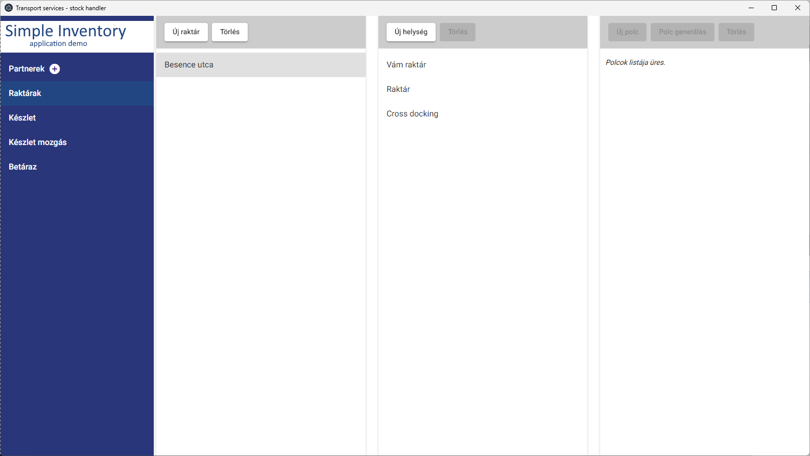

# Simple Inventory Application Demo

`npm install -g @angular/cli`

`npm install`

`npm run electron:local`

`npm run electron:build`

[PDF output](docs/2d222585-b825-4899-9ff0-49a6ce674f3e_2.pdf)

